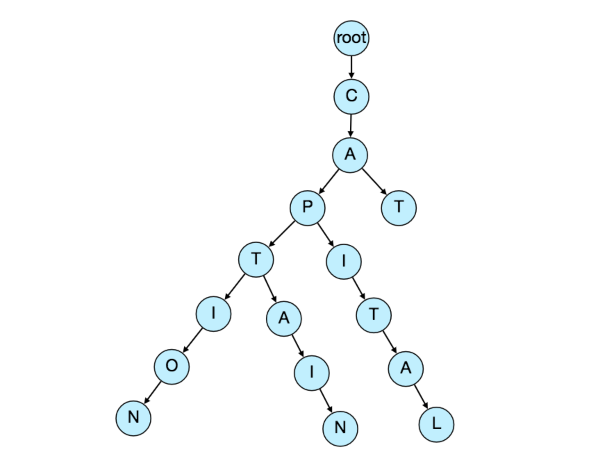
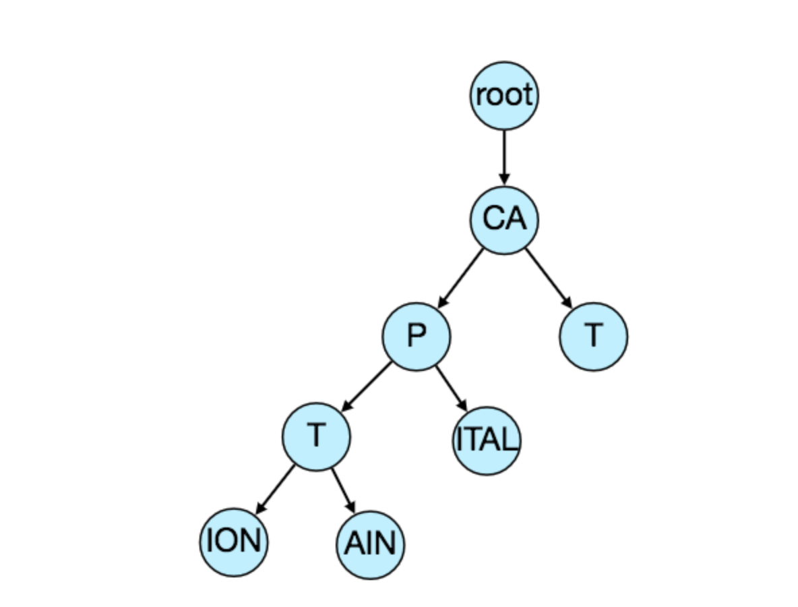
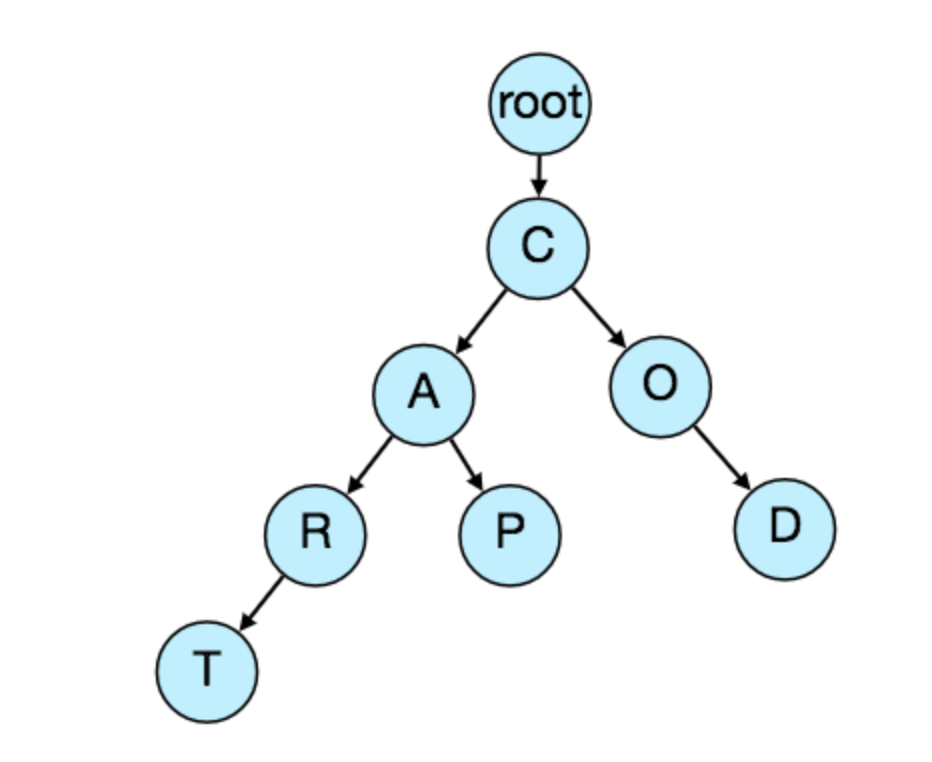

# Write code
https://leetcode.com/problems/design-search-autocomplete-system/
# Requirements and Goal of the system
## Functional Requirement

- As the user types in their query, our service should suggest top 10 terms starting with whatever the user has typed.
- Only search terms with frequency more than 1000 in one hour window should be display in the result
- Only search terms in last 7 days should be display in the result
- Able to filter few keywords based on piracy/legal issue
## Non functional requirements
- The suggestions should appear in real-time. 
- The user should be able to see the suggestions within 200ms.
## Not in scope
- No spell check
- No locale
- No personal info
- Only English
- Case insensitive
# Design constraints
- High performance, response should be quicker than user type speed, let’s say < 200ms
- Result accuracy and system availability are not strictly required
# Volume Constraints
- 5 billion searches every day
# Algorithm
## Data Structure
- We can’t depend upon some database for this; we need to store our index in memory in a highly efficient data structure.
- One of the most appropriate data structures that can serve our purpose is the Trie. 
- A trie is a tree-like data structure used to store phrases where each node stores a character of the phrase in a sequential manner. For example, if we need to store ‘cap, cat, caption, captain, capital’ in the trie, it would look like:

- We can merge nodes that have only one branch to save storage space. The above trie can be stored like this:


## How to find top suggestion? 
- Now that we can find all the terms for a given prefix, how can we find the top 10 terms for the given prefix? 
- One simple solution could be to store the count of searches that terminated at each node, e.g., if users have searched about ‘CAPTAIN’ 100 times and ‘CAPTION’ 500 times, we can store this number with the last character of the phrase. 
- Now if the user types ‘CAP’ we know the top most searched word under the prefix ‘CAP’ is ‘CAPTION’. 
- So, to find the top suggestions for a given prefix, we can traverse the sub-tree under it.

## Given a prefix, how much time will it take to traverse its sub-tree?
- For given phrase for example `CAP`, it will take O(S) where `S` is length of phrase. 
- To find out all matches, it needs `O(N)` where `N` is number of child nodes. 
- To find out top `K`, we need to sort and retrieve top `K`, it will take `O(KlogK)` using `K` size `Min Heap` 
- Total time taken: `O(S) + S(N) + S(KlogK)`
    - Need to optimize total time taken
## Store top suggestions with each node for better speed
- Store top `K` suggestion for all nodes. 
    - Total time taken: `O(S)`
- This speed up our searches but will require a lot of extra storage. 
- We have to bear the big increase in our storage capacity to achieve the required efficiency.
## Use prefix hash table to support constant time
- Store all possible nodes in prefix hash table with top `K` 
- This will return in constant time
## How would we build this trie? 
- We can efficiently build our trie bottom up i.e. post order dfs traversal. 
- Each parent node will recursively call all the child nodes to calculate their top suggestions and their counts. 
- Parent nodes will combine top suggestions from all of their children to determine their top suggestions.
## How to update the trie?
- Assuming five billion searches every day, which would give us approximately 60K queries per second. 
- If we try to update our trie for every query it’ll be extremely resource intensive and this can hamper our read requests, too. 
- One solution to handle this could be to update our trie offline after a certain interval.
    - As the new queries come in we can log them and also track their frequencies. 
    - Either we can log `every` query or do `sampling` and log every 1000th query. 
    - For example, if we don’t want to show a term which is searched for less than 1000 times, it’s safe to log every 1000th searched term.
- We can have a Map-Reduce (MR) set-up to process all the logging data periodically say every hour. 
    - These MR jobs will calculate frequencies of all searched terms in the past hour. We can then update our trie with this new data. 
- We can take the current snapshot of the trie and update it with all the new terms and their frequencies. We should do this offline as we don’t want our read queries to be blocked by update trie requests. 

We can have two options:
1. We can make a copy of the trie on each server to update it offline. Once done we can switch to start using it and discard the old one.
2. Another option is we can have a primary-secondary configuration for each trie server. We can update the primary while the secondary is serving traffic. Once the update is complete, secondary can update from primary.
## How can we update the frequencies of typeahead suggestions? 
- Since we are storing frequencies of our typeahead suggestions with each node, we need to update them too! 
- We can update only differences in frequencies rather than recounting all search terms from scratch. 
- If we’re keeping count of all the terms searched in the last 10 days, we’ll need to subtract the counts from the time period no longer included and add the counts for the new time period being included. 
- We can add and subtract frequencies based on Exponential Moving Average (EMA) of each term. 
- In EMA, we give more weight to the latest data. It’s also known as the exponentially weighted moving average.

- After inserting a new term in the trie, we’ll go to the terminal node of the phrase and increase its frequency. 
- Since we’re storing the top 10 queries in each node, it is possible that this particular search term jumped into the top 10 queries of a few other nodes. 
- So, we need to update the top 10 queries of those nodes then. 
- We have to traverse back from the node to all the way up to the root. 
- For every parent, we check if the current query is part of the top 10. 
- If so, we update the corresponding frequency. 
- If not, we check if the current query’s frequency is high enough to be a part of the top 10. 
- If so, we insert this new term and remove the term with the lowest frequency.

## How can we remove a term from the trie?
- Let’s say we have to remove a term from the trie because of some legal issue or hate or piracy etc. 
    - We can completely remove such terms from the trie when the regular update happens.
    - meanwhile, we can add a filtering layer on each server which will remove any such term before sending them to users.
- Remove Old search term no more actively being searched
    - Maintain timestamp for each terminal node
    - Write a separate nightly job to scan entire trie to find out node which is 10 days old, delete it

## What could be different ranking criteria for suggestions? 
### Pure Count Based Ranking
- Rank all search terms based on frequency count
### Local-Z Score Based Ranking
- In addition to a simple count, for terms ranking, we have to consider other factors too, e.g., 
    - freshness, 
    - user location, 
    - language, 
    - demographics, 
    - personal history
    - etc.

# Permanent Storage of the Trie
-  How to store trie in a file so that we can rebuild our trie easily - this will be needed when a machine restarts? 
- We can take a snapshot of our trie periodically and store it in a file. 
- This will enable us to rebuild a trie if the server goes down. 
- To store, we can start with the root node and save the trie level-by-level. 
- DFS travel
- With each node, we can store what character it contains and how many children it has. 
- Right after each node, we should put all of its children. 

Let’s assume we have the following trie:

- If we store this trie in a file with the above-mentioned scheme, we will have: “C#2,A#2,R#1,T#0,P#0,O#1,D#0”. From this
- We can rebuild trie recursively maintaining queue.
    - Split serialized string by comma separator
    - Push all into queue
    ['C#2','A#2','R#1','T#0','P#0','O#1','D#0']
    - pull from queue
    - create node from polled item
    - get number of child 
    - run in a loop to poll next items from queue to add all child
- If you’ve noticed, we are not storing top suggestions and their counts with each node. 
- It is hard to store this information; as our trie is being stored top-down, we don’t have child nodes created before the parent, so there is no easy way to store their references. 
- For this, we have to recalculate all the top terms with counts. 
- This can be done while we are building the trie. 
- Each node will calculate its top suggestions and pass it to its parent. Each parent node will merge results from all of its children to figure out its top suggestions.

# Trie Storage Estimation
## Estimate
- 5 billion searches every day
    - ~ 60K queries per seconds
- Since there will be a lot of duplicates in 5 billion queries, we can assume that only 20% of these will be unique.
    - unique terms 100 million
- We can get rid of a lot of less frequently searched queries. 

## Storage Estimation
- If on the average each query consists of 3 words and if the average length of a word is 5 characters, this will give us 15 characters of average query size.
- Assuming we need 2 bytes to store a character, we will need 30 bytes to store an average query.
-  So total storage for nodes we will need:
    - 100 million * 30 bytes => 3 GB
- Each nodes store top 10 results
    - Size of each node 30 bytes
    - Size of top 10 results: 300 bytes
    - Total size: 100 million * 300 bytes ~ 30GB
- Total trie storage: 33GB
- We can expect some growth in this data every day, but we should also be removing some terms that are not searched anymore.
- If we assume we have 2% new queries every day and if we are maintaining our index for the last one year, total storage we should expect:
    - 33GB + (0.02 * 33 GB * 365 days) => 273 GB
# Data Partition
Although our index can easily fit on one server, we can still partition it in order to meet our requirements of higher efficiency and lower latencies. How can we efficiently partition our data to distribute it onto multiple servers?
## Range Based Partitioning:
- What if we store our phrases in separate partitions based on their first letter. 
- So we save all the terms starting with the letter ‘A’ in one partition and those that start with the letter ‘B’ into another partition and so on. 
- We can even combine certain less frequently occurring letters into one partition. 
- We should come up with this partitioning scheme statically so that we can always store and search terms in a predictable manner.
- The main problem with this approach is that it can lead to unbalanced servers, for instance, if we decide to put all terms starting with the letter ‘E’ into one partition, but later we realize that we have too many terms that start with letter ‘E’ that we can’t fit into one partition.
- We can see that the above problem will happen with every statically defined scheme. 
- It is not possible to calculate if each of our partitions will fit on one server statically.
## Partition based on the maximum capacity of the server
- Let’s say we partition our trie based on the maximum memory capacity of the servers. 
- We can keep storing data on a server as long as it has memory available. 
- Whenever a sub-tree cannot fit into a server, we break our partition there to assign that range to this server and move on to the next server to repeat this process. 
- Let’s say if our first trie server can store all terms from ‘A’ to ‘AABC’, which mean our next server will store from ‘AABD’ onwards. 
- If our second server could store up to ‘BXA’, the next server will start from ‘BXB’, and so on. 
- We can keep a hash table to quickly access this partitioning scheme:
```
Server 1, A-AABC
Server 2, AABD-BXA
Server 3, BXB-CDA
```
- For querying, if the user has typed ‘A’ we have to query both servers 1 and 2 to find the top suggestions. 
- When the user has typed ‘AA’, we still have to query server 1 and 2, but when the user has typed ‘AAA’ we only need to query server 1.
- We can have a load balancer in front of our trie servers which can store this mapping and redirect traffic. 
- Also, if we are querying from multiple servers, either we need to merge the results on the server-side to calculate the overall top results or make our clients do that. 
- If we prefer to do this on the server-side, we need to introduce another layer of servers between load balancers and trie severs (let’s call them aggregator). 
- These servers will aggregate results from multiple trie servers and return the top results to the client.
- Partitioning based on the maximum capacity can still lead us to hotspots, e.g., if there are a lot of queries for terms starting with ‘cap’, the server holding it will have a high load compared to others.
## Partition based on the hash of the term
- Each term will be passed to a hash function, which will generate a server number and we will store the term on that server. 
- This will make our term distribution random and hence minimize hotspots. 
- The disadvantage of this scheme is, to find typeahead suggestions for a term we have to ask all the servers and then aggregate the results.

# Cache
- We should realize that caching the top searched terms will be extremely helpful in our service. 
- There will be a small percentage of queries that will be responsible for most of the traffic. 
- We can have separate cache servers in front of the trie servers holding the most frequently searched terms and their typeahead suggestions. 
- Application servers should check these cache servers before hitting the trie servers to see if they have the desired searched terms. 
- This will save us time to traverse the trie.
- We can also build a simple Machine Learning (ML) model that can try to predict the engagement on each suggestion based on simple counting, personalization, or trending data, and cache these terms beforehand.

# Typeahead client
We can perform the following optimizations on the client-side to improve user’s experience:
- The client should only try hitting the server if the user has not pressed any key for 50ms.
- If the user is constantly typing, the client can cancel the in-progress requests.
- Initially, the client can wait until the user enters a couple of characters.
- Clients can pre-fetch some data from the server to save future requests.
- Clients can store the recent history of suggestions locally. Recent history has a very high rate of being reused.
- Establishing an early connection with the server turns out to be one of the most important factors. As soon as the user opens the search engine website, the client can open a connection with the server. So when a user types in the first character, the client doesn’t waste time in establishing the connection.
- The server can push some part of their cache to CDNs and Internet Service Providers (ISPs) for efficiency.

# Personalization
- Users will receive some typeahead suggestions based on their historical searches, location, language, etc. 
- We can store the personal history of each user separately on the server and also cache them on the client. 
- The server can add these personalized terms in the final set before sending it to the user. 
- Personalized searches should always come before others.

# Overall Architecture
 