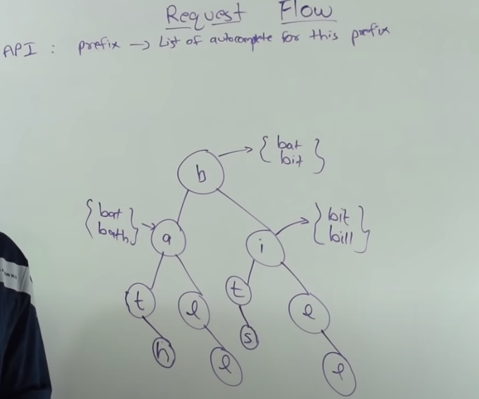
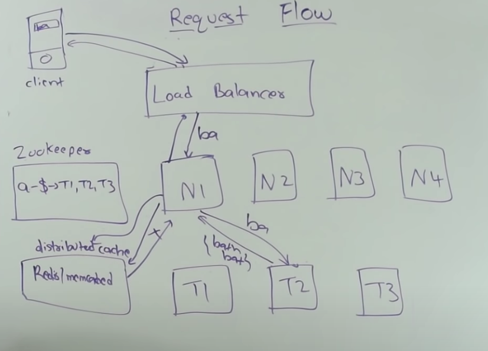
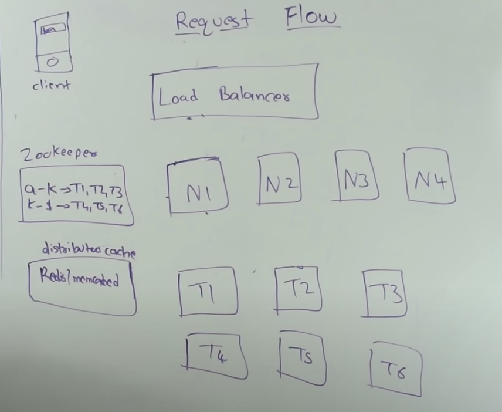
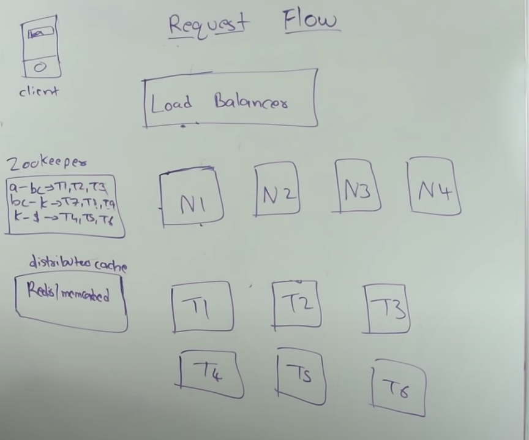
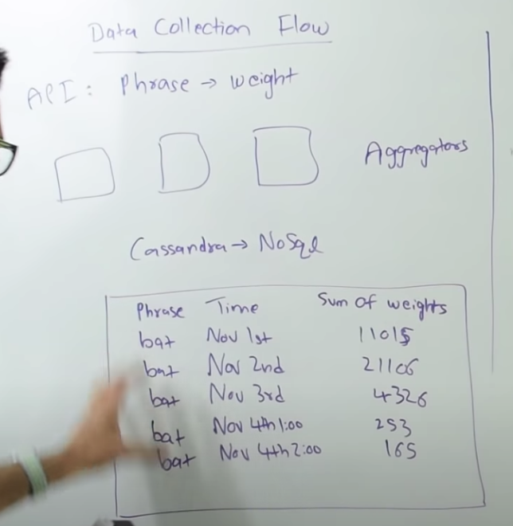

# Functional Requirement

# Design constraints
- No spell check
- No locale
- No personal info
- Only English
# Algorithm
Two flow
- Request flow
- Data collection flow
    - Store top k terms for node
    - Trie will be huge, can't keep on single node

# Request flow
## Solving as a single server
- Assumption is, single server can hold entire Trie data
- Add three replicas for each data

## Sharded on multiple cluster
- Simple shard

- More shards

# Data collection flow
## Collect phrase
- Get weight for each phrase
- Based on consistent hashing, phrase will be send to targeted aggregator
- Aggregator will continue to aggregate for 2 minutes of window (circular buffer) and then flush into database
- Aggregator will keep adding weight to one hour range row as per timestamp
- After current day passes then aggregate all current day data and write into single day row
- For optimization, we can loose x days old data
- If phrase has less weight then we can get rid of phrase all together as we know it will never be part of result
- Purpose of day wise phrase collection to give more weight to current data compare to old data
- Granularity of data is one hour
- Phrase with time and weight will be store in database

## Apply trie
- Have applier same number of shard
- Every applier will take care of its own target shard
- Applier will build Trie for its range and dump on each replicas of the target shard
- Applier will read data from database
## Optimiztion for request flow
- Use CDN to cache request
